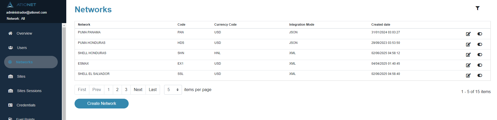
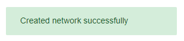
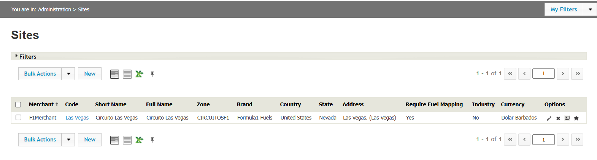
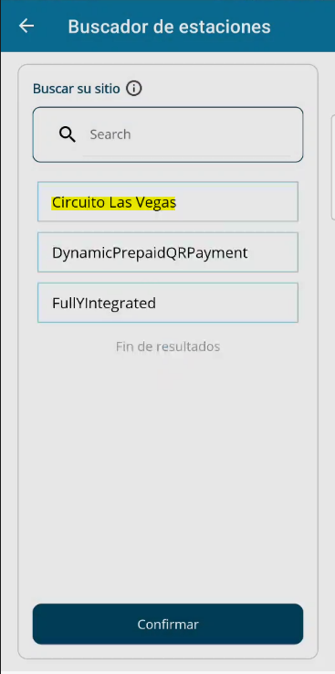
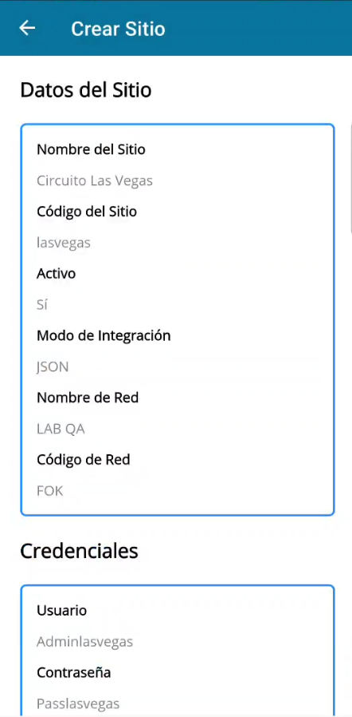
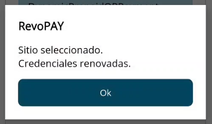

 
# RevoPAY Technician App

<!--  logo turns out being a little to big -->

|Document Information||
|--- |--- |
|Archivo:|ATIONet - RevoPAY Technician|
|Doc Version:|1.0|
|Date:|02-09-2025|
|Author:|Joaquín Miguens|

|Change Control |||
|--- |--- |--- |
|Ver.|Date|Changes|
|1.0|02-09-2025|Initial version.|

## Content
 - [Objective](#objective)
 - [Pre-Requisites](#pre-requisites)
    - [Ationet Configuration](#ationet-configuration)
    - [MobilePayment Configuration](#mobilepayment-configuration)
 - [How to use RevoPAY Technician](#how-to-use-revopay-technician)

### Objective

The main objective of RevoPAY Technician, is to allow an easy configuration for RevoPAY. In just a few minutes after arrival, the technician can conect via BLE (Bluetooth Low Enery) to RevoPAY and make every configuration needed in order to have it up and running, ready to go. Besides, it facilitates extra configuration in MobilePayment, such as crating an existing site in Ationet inside MobilePayment, and its corresponding credentials. 

### Pre-Requisites
* This entity is a software application embedded in a Mobile Device or downloaded by a consumer onto a Mobile Device, such as a smartphone or tablet. Supports both Android and IOs devices.

* An existing user with the NWTechnician role in Ationet.

* An existing network in MobilePayment with the exact same NetworkCode (XYZ) as in Ationet.

* A RevoPAY plugged on and near in order to have a successfull Bluetooth communication.

* An existing site in Ationet with an active AN-MobilePayment terminal.

## Ationet Configuration 
- [NWTechnicianRole](#ationet-configuration-for-revopay-technician)
- [Site with AN-MobilePayment associated terminal](#site-with-an-mobilepayment-associated-terminal)

## MobilePayment Configuration

- [Network](#network-configuration-for-revopay-technician) 
- [How to create a Network in MobilePayment](#how-to-create-a-network-in-mobilepayment) 

 

## How to use RevoPAY Technician

Once you have an existing user with the NWTechnician role and the Network is created in MobilePayment, you are ready to go.
This guide will explain the different actions aveilable inside the app and how to use them.

 - [Login](#app-login)
    - [Biometric Authentication](#)
    - [Forgot password?](#)
    - [Entity Selector](#entity-selector)   
    - [Site Selector](#site-selector) 
 - [HomeView](#app-homeview)
    - [LogOut](#app-logout)
    - [Change Site](#site-selector)
    - [Settings](#app-settings)
        - [Change Entity](#)
        - [Change Password](#)
    - [RevoPAY](#app-revopay)
        - [Bluetooth Scanner](#app-blutooth-scanner)
        - [Wifi Configuration](#app-wifi-configuration-for-revopay)
        - [Appsettings Configuration](#app-appsettings-configuration-for-revopay)

 

    

## Network Configuration For RevoPAY Technician

Once you log in into RevoPAY Technician, an Entity Selector will be shown. If the user only has one associated network in Ationet, it will automatically select it, otherwise, it will ask the technician to pick which Network he will be working with. This step is needed in order to show the technician the corresponding sites for the selected Network. 

### Conditions

As mentioned, in order to move foward with the configuration for RevoPAY, the technician must select an entity. After it is selected, it will validate the network's existance in MobilePayment. In order for this condition to be satisfied, there must be one network with the same CODE both Ationet and MobilePayment. If it shares the Code, then it will be considered as the SAME Network by RevoPAY Technician.

### Inexistant MobilePayment Network

In case the Network does not exist in MobilePayment, RevoPAY Technician will display an error message indicating that the network is inexistant in MobilePayment, and that in order to proceed, it must first be created. This is the reason creating the Network in MobilePayment is a requisite.

 

## How to create a Network in MobilePayment

Steps :

 * Log in the MobilePayment https://ationetmobilepayment-appshostportal.azurewebsites.net/Login
    
 * Go to the Networks module
      
 * Press the Create Network button 

 * Fill the information as needed (remind to use the exact same code as in Ationet, we recommend to complete the Name and Currency just the same way for clearance)
       

 * Validate the Network was created Succesfully and it is enabled (if it is disabled, remember to enable it)!

     
     

 

## Ationet Configuration For RevoPAY Technician
### NWTechnician Role Configuration

In order to log in RevoPAY Technician successfully, it needs a user with the specific role of NWTechnician. 
If the introduced user doesn't have that role, it won't be able to log in. 

NWTechnician supports several networks, therefore, the same technician may be able to configure several sites, from several entities. The role only has access to the Sites, Terminals and Notifications menu, as they are the only modules the app will need.

And once the user is ready, you can now log in RevoPAY Technician!

 

 

## Site with AN-MobilePayment associated terminal

Once you have already logged with a NWTechician user, you will be asked to select wich site to configure. The shown list will ONLY show sites that belong to the selected entity and, most importantly, among those sites, ONLY the ones that have an ACTIVE AN-MobilePayment terminal associated.

If the sites display does not show your site, then please check the following validations.

* The site exists in Ationet (Check in Ationet's Sites module).
* The site has an associated AN-MobilePayment terminal (Check in Ationet's Terminals module).
* The AN-MobilePayement terminal is active.

 

### Once this conditions are satisfied, Technician's site selector will display your Site!

 

## App Login

 

When you first open the app, it will ask for a username and a password. This must be the ones of a NWTechnican user in Ationet, otherwise it wont log in. Neither the user field nor the password field can be empty, and the user must have a valid mail format. After pressing Log In, if the user and password are valid, the technician will be asked to select an entity!

### Entity Selector

Here the technician will be asked to select which network to work on. The list only shows the networks associated to the user in Ationet. In case the user only has one network associated, it will automatically select it. Otherwise, the technician must indicate which one.

### Site Selector

After selecting the Entity, it will show a Sites display view, where the technician will be able to select which site is he working on.
The display will ONLY show the sites belonging to the selected Network that have an ACTIVE AN-MobilePayment type terminal associated. Othershie, either the terminal is inactive, or the terminal isn't an AN-MobilePayment one, or the terminal is not associated to the site, then, the site won't appear on the list. 

Once you find your site (there is a filter to search for Site Name) and confirm, there are three scenarios.

 - The site doesn't exit in MobilePayment.
 - The site exists in MobilePayment in the selected Network, and satisfies the Code conditions for RevoPAY.
 - The site exists in MobilePayment and satisfies the Code conditions for RevoPAY, but belongs to another network.

 
 
## The site doesn't exit in MobilePayment

In this case, the app will show you a Site Creation view, where the technician will be able to see the site information and confirm its creation.
It will also create new credentials, with the following format : 
    - User : Admin{SiteCode}
    - Pass : Admin{SiteCode}
    Where the Site Code will be in lowercase and without blank spaces, as it is one condition for RevoPAY to work correctly! 

 

## The site exists in MobilePayment in the selected Network, and satisfies the Code conditions for RevoPAY

In this case, the app will show you a Site Creation view, where the technician will be able to see the site information and confirm its creation.
It will also create new credentials, with the following format : 

    - User : Admin{SiteCode}
    - Pass : Pass{SiteCode}                   

     ej: Code = 123 => User = Admin123
                       Pass = Pass123 
Where the Site Code will be in lowercase and without blank spaces, as it is one condition for RevoPAY to work correctly! 

In this case, only a simple "Site Selected. Credentials renewed" message display will be shown.

 

## The site exists in MobilePayment and satisfies the Code conditions for RevoPAY, but belongs to another network.

Due to how RevoPAY functions, it does not allow having to sites with the same code, independently from the Network. Therefore, it won't allow to create a Site with the same code as an already existing one, belonging to another network, as that would result in neither of the sites working correctly with RevoPAY. In this case, it is recommended to change the Site Code in Ationet. Remember Site Codes in mobile payment will be in lowercase, without blank spaces, and no special characters! 

If this scenario is reached, the app will show it with the following display message : 

