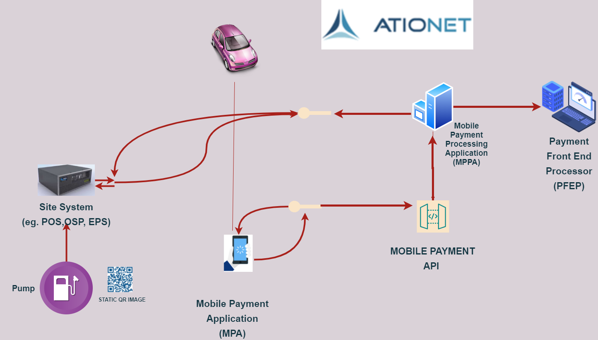
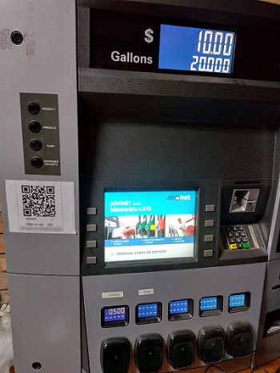

# Ationet Fleet Mobile Payment MPPA #

|Document Information||
|--- |--- |
|File:|ATIONet - MPPA Payments|
|Doc Version:|1.0|
|Release Date:|03, December 2024|
|Author:|ATIONet LLC|

|Change Log|||
|--- |--- |--- |
|Ver.|Date|Change Summary|
|1.0|03/December/2024|Initial version.|


## Contents ##

- [Overview](#overview)
	- [Introduction](#introduction)
	- [Entities](#Entities)
	- [Sequence diagram Pay at Pump](#Sequence-diagram-Pre-Pay-at-Pump)
- [Site System Configuration](#Site-System-Configuration)
	- [Introduction](#introduction)
	- [Description](#description)
 	- [API Details](#api-details)  
	- [Site System Configuration Methods](#site-system-configuration-Methods)
 - [PrePaid Flow]
   	- [Flow Description]
	- [PrePaid Site System Implementation](#prepaid-site-system-implementation)
		- [Reserve Notification (POST)]
   		- [Reserve Notification (DELETE)]
    		- [TransactionInfo]
     		- [Authorization Notification]
      		- [BeginFuelingNotification]
       		- [FinalizeTransactionNotification]  
	- [Mobile Paymnet Processor](#mobile-paymnet-processor)
		- [Authorize](#Authorize)
		- [Notifications](#Notifications)
	  	- [GetTransaction](#GetTransaction)
 - [PostPaid Flow]
   	- [Flow Description]
  	- [PostPaid Site System Implementation](#prepaid-site-system-implementation)
     		-[TransactionData]
      		-[CloseTransactionNotification]    
        - [Mobile Paymnet Processor](#mobile-paymnet-processor)
          	- [PaymentRequest]
          	- [Notifications](#Notifications)
	  	- [GetTransaction](#GetTransaction)

  - [General Information](#general-information)
	- [Error Handling](#error-handling)
	- [Transactions States](#transactions-states)
	- [Response Codes](#response-codes)  	

</br>

## Overview



### Introduction

This Implementation Guide is intended to guide petroleum convenience retailers and their associated vendors when implementing mobile payment solutions consistent with Conexxus Implementation Guide
</br>


### Entities

This section outlines the logical entities, including location options, for Mobile Payment and identifies possible physical architectures. The term “entity” is used in this
document to differentiate logical processing functionality without regard to its physical location in an implementation. 


```Mobile Payment Application (MPA):```  This entity is a software application embedded in a Mobile Device or downloaded by a consumer onto a Mobile Device, such as a smart
phone or tablet, which enables mobile payments for in-store and forecourt transactions.

```Mobile Payment Processing Application (MPPA):``` This entity is an application provided by the Mobile Payment Processor (MPP) not on the Mobile Device that is responsible for
interfacing between the Token Vault or Token/Trusted Service Provider, the MPA, the Site System, the Payment Front End Processor (PFEP), and the Loyalty Front End Processor (LFEP) in order to authorize transactions.

```Payment Front End Processor (PFEP):``` This entity is a host that facilitates the authorization of payment transactions between the MPPA or the Site System and the
Issuer networks. The standard does not dictate the processing that is performed by the PFEP for each payment method. This entity is sometimes referred to as the Front End
Processor (FEP).

```Site System:``` This entity encompasses the site equipment and components (hardware and software) and may perform the function of local card processing business rules,
such as consumer prompting, local velocity checking and receipt formatting and printing. Examples of site systems include Point of Sale (POS), Outside Sales Processor
(OSP), Electronic Payment Server (EPS) and Forecourt Device Controller (FDC).
</br>
>Note: MOBILE PAYMENT API is the common interface through which the MPA sends and receives requests from the MPPA. The description, you can read about  the methods and how to consume in [API Section](#ATIONet-PFEP-Fleet-Mobile-Payment-Api).


### Sequence diagram Pre Pay at Pump 


<ol>
	<li>Mobile Payment Application (MPA) is activated by consumer.</li>
	<li>Scan the QR code to start the operation</li>
	<li>MPA sends information to MPPA as an Authorization Request.</li>
	<li>MPPA sends a Mobile Pump Reserve Request to the Site System to reserve the fueling point.</li>
	<li>Site System responds to the Mobile Pump Reserve Request.</li>
	<li>The MPPA sends a Mobile Auth Request to the Site System. If generated, the validation code in the payload.</li>
	<li>The PFEP (through the site system) sends the payment to the MPPA.</li>
	<li>The MPPA sends a Mobile Auth Request to Site Systen.</li>
	<li>The Site Systen response to MPPA with a Mobile Auth Response.</li>
	<li>MPA validates transaction status</li>
	<li>MPPA sent to Site System a authorization message.</li>
	<li>Site System send to MPPA a Begin Fueling Message.</li>
	<li>Site System send to MPPA a Finalize Trx Message.</li>
</ol>


### Static QR Image

Static QR Image is a photo that is pasted in the Pump and contains the pump Number and the Site code, it's mandatory data to do a Transacction.
Below is an image as an example



# Site System Configuration

### Introduction

This specification is intended to document ATIONet’s fleet Mobile Payment API messaging format and related features required for usarage. The following sections provide descriptions of the messages themselves, the expected behaviour for each supported transaction type and a common ground for the functionality of each relevant item.

 
### Description 

ATIONet’s fleet Mobile Payment API It is responsible for intermediating the mobile payment transaction between the SiteSystem and the payment processor.

### API Details

API URI: *https://mobilepayapi.ationet.com/*

### Site System Configuration Methods

<table>
	<thead>
		<tr valign="center">
			<th rowspan="2" width="125" align="left">
				Name
			</th>
			<th colspan="2" align="center">
				Ver.
			</th>
			<th rowspan="2" align="left">
				Description
			</th>
		</tr>
		 <tr valign="top">
			  <th align="center">
					Initial
			  </th>
			  <th align="center">
					Change
			  </th>
		 </tr>
	</thead>
	<tbody>
		 <tr valign="top">
			<td>
				<p align="left">Connection</p>
			</td>
			<td>
				<p align="center">1.0</p>
			</td>
			<td></td>
			<td>
				<p align="left">Allows you to send a message to determine if the Host is available or not. In turn, this message allows to validate if there is a session with problems for the specified site.</p>
			</td>
		 </tr>
		<tr valign="top">
			<td>
				<p align="left">MobileEvents</p>
			</td>
			<td>
				<p align="center">1.0</p>
			</td>
			<td></td>
			<td>
				<p align="left">Allows you to create a new session to be able to operate.</p>
			</td>
		 </tr>
		 <tr valign="top">
			<td>
				<p align="left">SiteData</p>
			</td>
			<td>
				<p align="center">1.0</p>
			</td>
			<td></td>
			<td>
				<p align="left">Allows you to configure the site to an existing session
				</p>
			</td>
		 </tr>
		 <tr valign="top">
			<td>
				<p align="left">Products</p>
			</td>
			<td>
				<p align="center">1.0</p>
			</td>
			<td></td>
			<td>
				<p align="left">Allows you to configure the list of products with which an existing session will operate.</p>
			</td>
		 </tr>
		 <tr valign="top">
			<td>
				<p align="left">DSPS</p>
			</td>
			<td>
				<p align="center">1.0</p>
			</td>
			<td></td>
			<td>
				<p align="left">Allows you to configure the list of nozzles available for the session.</p>
			</td>
		 </tr>
		 <tr valign="top">
			<td>
				<p align="left">SSE</p>
			</td>
			<td>
				<p align="center">1.0</p>
			</td>
			<td></td>
			<td>
				<p align="left">Establishes a one-way communication channel between the SiteSystem and the PFEP, where the PFEP can notify the SiteSystem of various messages for the operation.</p>
			</td>
		 </tr>
	
</table>


## Message Structure

This section describe the message structure for each API Method available, as well as the responses messages for each one.

### Connection 

Allows you to send a message to determine if the Host is available or not. In turn, this message allows to validate if there is a session with problems for the specified site.

#### Request Format

*URL: /v{{Version}}/SiteSystem/connection* </br>
*Method: POST* </br>
*Body:*
```json
{
  "APPLICATIONSENDER": "{{SiteId}}",
  "WORKSTATIONID": "{{SiteId}}",
  "TIMESTAMP": "2009-11-20T17:30:50",
  "INTERFACEVERSION": "1.0"
}
```

 </br>

#### Response Format

*Header:*

	Content-Type: application/json; charset=utf-8
	content-encoding: gzip 

*Body:	None*
*HTTP Code 200*


### MobileEvents 

Allows you to create a new session to be able to operate.


#### Request Format

*URL: /v{{Version}}/SiteSystem/MobileEvents?applicationSender={{SiteId}}* </br>
*Method: GET* </br>

*Body: None * </br>

#### Response Format

*Header:*

	Content-Type: application/json; charset=utf-8
	content-encoding: gzip 

*Body:	none*
*HTTP Code 200*


### SiteData

Allows you to configure the site to an existing session

#### Request Format

*URL: v{{Version}}/SiteSystem/SSE/{{SiteSessionId}}/siteData* </br>
*Method: GET* </br>
*Body:*
```json
{
     "name" : "IFSF/Conexxus Station",   
     "siteIDs" : [
             { "type":"SHIPTO", "id": "{{SiteId}}" } 
     ],
     "addressLines" : [
       "Delta 1A, Building L’Aimant",   
       "Business Park Ijsseloord 2"
     ]
   }
```
</br>

#### Response Format

*Header:*

	Content-Type: application/json; charset=utf-8
	content-encoding: gzip 

*Body:	none*
*HTTP Code 200*


### Products 

Allows you to configure the list of products with which an existing session will operate.

#### Request Format

*URL: /v{{Version}}/SiteSystem/SSE/{{SiteSessionId}}/products* </br>
*Method: POST* </br>
*Body:*
```json
{
   "fuelProducts":[
      {
         "productNo":"1",
         "productID":{
            "productName":"Premium",
            "description": "Premium"
         },
         "productCode":"CODE1",
         "prices":[
            {
               "fuelUnitPrice":{
                  "value":"20.00",
                  "currency":""
               },
               "priceTier":"cash",
               "modeNo":"1"
            },
            {
               "fuelUnitPrice":{
                  "value":"25.00",
                  "currency":""
               },
               "priceTier":"cash",
               "modeNo":"2"
            }
         ]
      },
      {
         "productNo":"2",
         "productID":{
            "productName":"Premium",
            "description": "Premium"
         },
         "productCode":"CODE2",
         "prices":[
            {
               "fuelUnitPrice":{
                  "value":"30.00",
                  "currency":""
               },
               "priceTier":"cash",
               "modeNo":"1"
            },
            {
               "fuelUnitPrice":{
                  "value":"35.00",
                  "currency":""
               },
               "priceTier":"cash",
               "modeNo":"2"
            }
         ]
      }
   ]
}
```
</br>

#### Response Format

*Header:*

	Content-Type: application/json; charset=utf-8
	content-encoding: gzip 

*Body:	none*
*HTTP Code 200*


### DSPS 

Allows you to configure the list of nozzles available for the session.

#### Request Format

*URL: /v{{Version}}/SiteSystem/SSE/{{SiteSessionId}}/dsps* </br>
*Method: POST* </br>
*Body:*
```json
{
  "dispensersConfiguration": [
    {
      "dispenserID": "1",
      "fuelingPoints": [
        {
          "fuelingPointID": "1",
          "nozzles": [
            {
              "nozzleNo": "1",
              "productNo": "1",
              "tankNo1": "1"
            },
            {
              "nozzleNo": "2",
              "productNo": "2",
              "tankNo1": "2"
            },
            {
              "nozzleNo": "3",
              "productNo": "3",
              "tankNo1": "3"
            },
            {
              "nozzleNo": "4",
              "productNo": "4",
              "tankNo1": "4"
            }
          ]
        }
      ]
    },
    {
      "dispenserID": "2",
      "fuelingPoints": [
        {
          "fuelingPointID": "2",
          "nozzles": [
            {
              "nozzleNo": "1",
              "productNo": "1",
              "tankNo1": "1"
            },
            {
              "nozzleNo": "2",
              "productNo": "2",
              "tankNo1": "2"
            },
            {
              "nozzleNo": "3",
              "productNo": "3",
              "tankNo1": "3"
            },
            {
              "nozzleNo": "4",
              "productNo": "4",
              "tankNo1": "4"
            }
          ]
        }
      ]
    }
  ]
}
```
</br>

#### Response Format

*Header:*

	Content-Type: application/json; charset=utf-8
	content-encoding: gzip 

*Body:	none*
*HTTP Code 200*


### SSE 

Allows you to configure the list of nozzles available for the session.

#### Request Format

*URL: /v{{Version}}/SiteSystem/SSE/{{SiteSessionId}}/dsps* </br>
*Method: GET* </br>
*HEader:*
	Content-Type: text/event-stream;  
*Body:*
</br>

#### Response Format

*Header:*

	Content-Type: text/event-stream;  

*Body:	Message on the SSE channel*


# Mobile Paymnet Processor


### Authorize 

Allows to initiate a mobile authorization so that the SiteSystem can receive an intention to pay for a dispatch.

#### Request Format

*URL: /v{{Version}}/MPA/prepaid/{{PosId}}/Authorize* </br>
*Method: Post* </br>
*Body:* none


</br>

#### Response Format

*Header:*

	Content-Type: text/event-stream;  

*Body:*

```json
{
transactionId = GUID
}

```


### Notifications 

Allows external payment processor to send a payment object search notification

#### Request Format

*URL: /v{{Version}}/MPA/prepaid/Notifications/{{TransactionId}}?topic={{value}}&id={{value}}* </br>
*Method: Post* </br>
*Body:* none


</br>

#### Response Format

*Header:*

	Content-Type: text/event-stream;  

*Body: none*
*HTTP Code 200*


### GetTransaction 

Allows external payment processor to send a payment object search notification

#### Request Format

*URL: /v{{Version}}/MPA/prepaid/Transaction/{{transactionId}}* </br>
*Method: Post* </br>
*Body:* none


</br>

#### Response Format

*Header:*

	Content-Type: text/json;  

*Body:*

```json
{
    "id": "1a5b9c3b-7036-4eee-ac07-393adc732b9a",
    "siteCode": "99991",
    "primaryTrack": null,
    "odometer": 0,
    "terminalIdentification": null,
    "transactionSequenceNumber": 25569,
    "state_Name": "Site System not Accept Pump Reserve",
    "state_Id": 6,
    "paymentProcessorReferenceId": null,
    "paymentProcessorMessage": null,
    "siteSystemMessage": "Cancel by CancelReserveNotification",
    "fuelPointNumber": 1,
    "paymentMethod": "ExternalPrepaid",
    "requestedAmount": 0.00,
    "authorizedAmount": 0.00,
    "dispatchedAmount": 0.00,
    "dispatchedQuantity": 0.00,
    "productCode": "",
    "productDescription": null,
    "productUnitPrice": 0.00,
    "unitMeasure": "LTR",
    "createDateTime": "2024-11-13T20:20:36.5334149",
    "updateDateTime": "2024-11-13T20:21:51.3733333",
    "idDispatch": "00000000-0000-0000-0000-000000000000"
}

```

*HTTP Code 200*


#General Information

## Error Handling

Success/failure will be handled via HTTP status codes.

Successful request will get a HTTP 200 and the resulting response.

Failure to process the request will be indicated by an HTTP 400’s range status code.


## Transactions States

This section describe through a table  all  states that a sale can have.


<table>
	<thead>
		<tr valign="center">
			<th rowspan="2" width="125" align="left">
				State name
			</th>			
			<th rowspan="2" width="125" align="center">
				ID
			</th>			
			<th rowspan="2" width="300" align="left">
				Message
			</th>
		</tr>		
	</thead>
	<tbody>
		 <tr valign="top">
			<td>
				<p align="left">Created</p>
			</td>
			<td>
				<p align="center">1</p>
			</td>
			<td>
				<p align="left"  width="125">Created</p>
			</td>
		 </tr>
		<tr valign="top">
			<td>
				<p align="left">PreauthorizationAccepted</p>
			</td>
			<td>
				<p align="center">2</p>
			</td>
			<td>
				<p align="left"  width="125">Preauthorization Accepted</p>
			</td>
		 </tr>
		<tr valign="top">
			<td>
				<p align="left">PreauthorizationRejected</p>
			</td>
			<td>
				<p align="center">3</p>
			</td>
			<td>
				<p align="left"  width="125">Preauthorization Rejected</p>
			</td>
		 </tr>
		<tr valign="top">
			<td>
				<p align="left">FuelPointAuthorizationRequested</p>
			</td>
			<td>
				<p align="center">4</p>
			</td>
			<td>
				<p align="left"  width="125">FuelPoint Authorization Requested</p>
			</td>
		 </tr>
		<tr valign="top">
			<td>
				<p align="left">PumpReserveAccepted</p>
			</td>
			<td>
				<p align="center">5</p>
			</td>
			<td>
				<p align="left"  width="125">Site System Accept Pump Reserve</p>
			</td>
		 </tr>
		<tr valign="top">
			<td>
				<p align="left">PumpReserveRefused</p>
			</td>
			<td>
				<p align="center">6</p>
			</td>
			<td>
				<p align="left"  width="125">Site System not Accept Pump Reserve</p>
			</td>
		 </tr>
		<tr valign="top">
			<td>
				<p align="left">FuelPointAuthorized</p>
			</td>
			<td>
				<p align="center">7</p>
			</td>
			<td>
				<p align="left"  width="125">Fuel Point Authorized</p>
			</td>
		 </tr>
		<tr valign="top">
			<td>
				<p align="left">CanceledByFuelPoint</p>
			</td>
			<td>
				<p align="center">8</p>
			</td>
			<td>
				<p align="left"  width="125">Canceled By Fuel Point</p>
			</td>
		 </tr>
		<tr valign="top">
			<td>
				<p align="left">Fueling</p>
			</td>
			<td>
				<p align="center">9</p>
			</td>
			<td>
				<p align="left"  width="125">Fueling</p>
			</td>
		 </tr>
		<tr valign="top">
			<td>
				<p align="left">Complete</p>
			</td>
			<td>
				<p align="center">10</p>
			</td>
			<td>
				<p align="left"  width="125">Complete</p>
			</td>
		 </tr>
		<tr valign="top">
			<td>
				<p align="left">CompleteFailed</p>
			</td>
			<td>
				<p align="center">11</p>
			</td>
			<td>
				<p align="left"  width="125">Complete Failed</p>
			</td>
		 </tr>
		<tr valign="top">
			<td>
				<p align="left">CanceledBySiteSystem</p>
			</td>
			<td>
				<p align="center">14</p>
			</td>
			<td>
				<p align="left"  width="125">Canceled By Site System</p>
			</td>
		 </tr>
		<tr valign="top">
			<td>
				<p align="left">CancelledByMPPA</p>
			</td>
			<td>
				<p align="center">19</p>
			</td>
			<td>
				<p align="left"  width="125">Cancelled By MPPA</p>
			</td>
		 </tr>
</table>


## Response Codes

### MobilePayments codes
	
Both methos response the same codes.

<table>
	<thead>
		<tr valign="center">
			<th rowspan="3" width="125" align="left">
				Code
			</th>
			<th rowspan="3" width="125" align="left">
				Description
			</th>
		</tr>
	</thead>
	<tbody>
		<tr valign="top">
			<td>
			<p align="left">200</p>
			</td>
			<td>
				<p align="left">Success</p>
			</td>
		 </tr>
			<tr valign="top">
			<td>
			<p align="left">400</p>
			</td>
			<td>
				<p align="left">Bad request</p>
			</td>
		 </tr>
	 </tbody>
		
</table>
